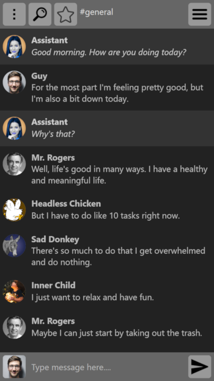

# Kurlan
A chat app where you talk to yourself and identify who's really doing the talking.

The purpose of this app is to help raise self-awareness and maintain mental health. However, it should not be used to replace professional therapy.

Not yet packaged as a standalone app. Only usable with expo: `expo start` / `expo start:web`.

